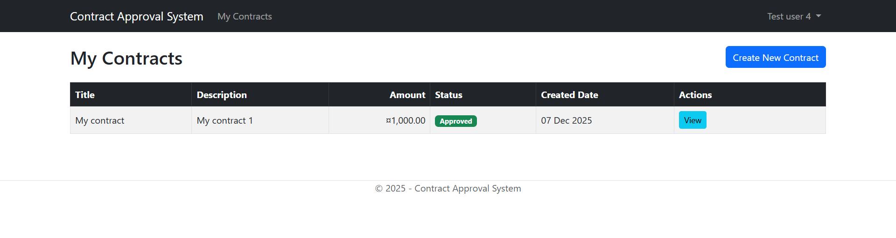
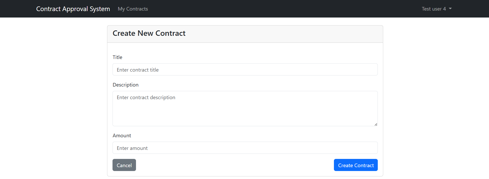
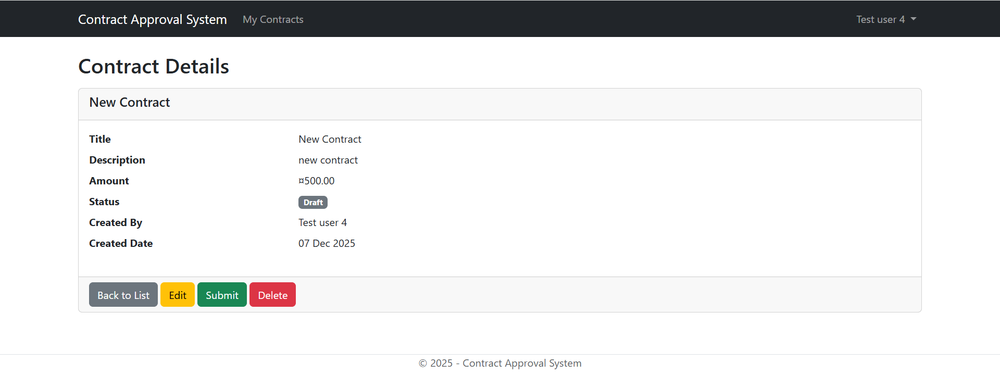
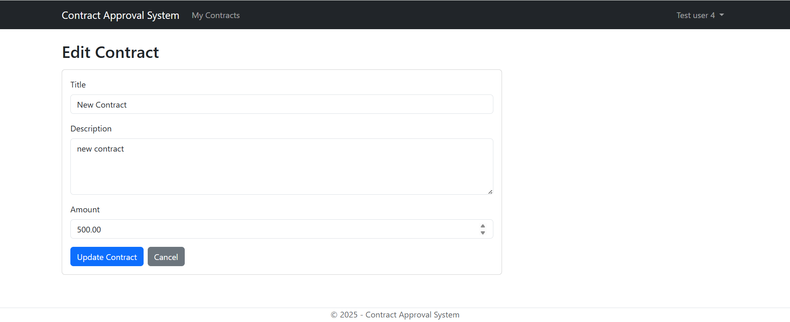
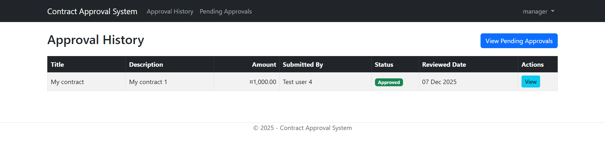
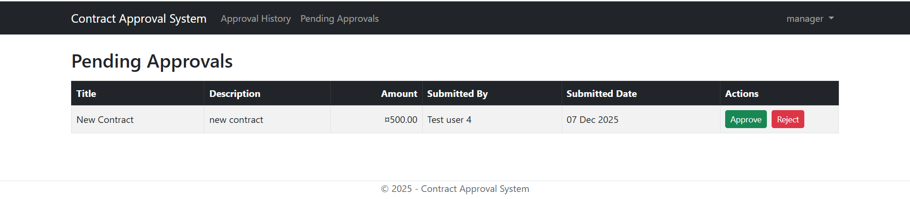

# Contract Approval System

A full-stack web application for managing contract workflows with role-based access control, built with ASP.NET Core MVC and PostgreSQL.

🔗 **Live Demo:** https://contractapprovalsystem.onrender.com

  

---

## 🎯 Project Overview

A contract management system where **Users** create and submit contracts, and **Managers** review and approve/reject them. Features secure authentication, clean architecture, and production deployment.

**Key Features:**
- ✅ Role-based access (User/Manager)
- ✅ Full CRUD operations with workflow (Draft → Pending → Approved/Rejected)
- ✅ BCrypt password hashing
- ✅ Session-based authentication with CSRF protection
- ✅ Responsive Bootstrap UI
- ✅ Dockerized deployment on Render.com

---

## 🛠️ Tech Stack

**Backend:** ASP.NET Core 8.0 MVC, Entity Framework Core, C# 12  
**Database:** PostgreSQL 13+  
**Frontend:** Razor Views, Bootstrap 5.3  
**Architecture:** Clean Architecture (Repository + Unit of Work patterns)  
**Deployment:** Docker, Render.com, GitHub Actions (auto-deploy)

**Project Structure:**
├── Core/ # Domain models & interfaces
├── Infrastructure/ # EF Core, repositories, migrations
├── Services/ # Business logic & DTOs
└── Web/ # MVC controllers & Razor views

## 📸 Screenshots

### User Features

#### My Contracts Dashboard

#### Create New Contract

#### View Contract Details

#### Edit Contract

### Manager Features

#### Pending Approvals

#### Approval History

🚀 Quick Start
### Prerequisites
- .NET 8.0 SDK
- PostgreSQL 13+

### Run Locally
Clone repo

Update connection string in appsettings.json
"Host=localhost;Database=ContractApprovalDB;Username=postgres;Password=YOUR_PASSWORD"

Restore & run migrations
dotnet restore
dotnet ef database update --project ContractApprovalSystem.Infrastructure --startup-project ContractApprovalSystem.Web

Run application
dotnet run --project ContractApprovalSystem.Web

Open `https://localhost:5001`

---

## 💡 Key Technical Highlights

1. **Clean Architecture:** Separated concerns across Core, Infrastructure, Services, and Web layers
2. **Repository Pattern:** Abstracted data access with Unit of Work for transaction management
3. **Security:** BCrypt password hashing, anti-forgery tokens, role-based authorization
4. **CI/CD:** Automatic deployment from GitHub to Render using Docker
5. **Database Migrations:** EF Core Code-First approach with versioned migrations

---

## 📊 Database Schema

**Users** → **Contracts** (1:many) → **Approvals** (1:many)

- **Users:** Email, PasswordHash, Role (User/Manager)
- **Contracts:** Title, Description, Amount, Status, CreatedBy
- **Approvals:** ContractId, ApproverId, Status, Comments

---

## 🔧 Environment Variables

| Variable | Description |
|----------|-------------|
| `ConnectionStrings__DefaultConnection` | PostgreSQL connection string |
| `ASPNETCORE_ENVIRONMENT` | Development/Production |

---

## 🎓 Skills Demonstrated

- ASP.NET Core MVC development
- Entity Framework Core & PostgreSQL
- Clean Architecture & Design Patterns
- Docker containerization
- Cloud deployment (Render.com)
- Version control with Git/GitHub
- Security best practices (authentication, authorization, encryption)

---

## 📝 Usage Flow

**User:** Register → Login → Create Contract → Submit for Approval  
**Manager:** Login → View Pending → Approve/Reject → View History

---

## 👤 Author

**Kunal Bhandare** - Backend Developer  
📧 kunalbhandare104@gmail.com | 💼 [LinkedIn](https://www.linkedin.com/in/kunal-bhandare/)
---

**⭐ Live Demo:** [https://contractapproval-app.onrender.com](https://contractapprovalsystem.onrender.com)
